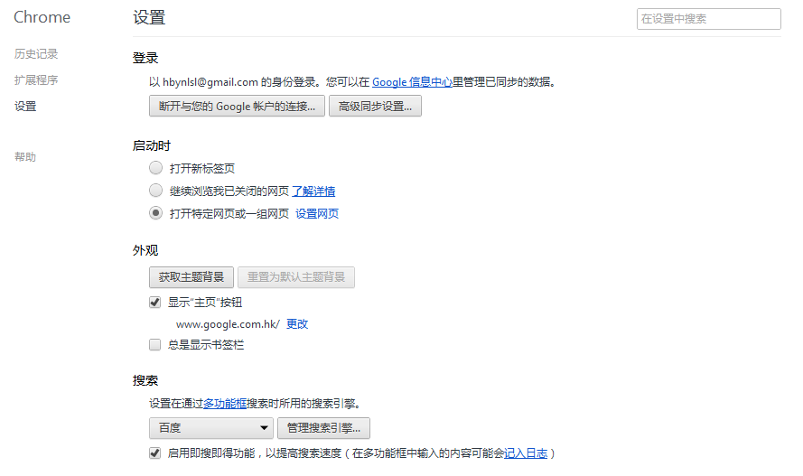

# 实验一 web开发基础知识
## 一  实验背景
&emsp;&emsp;本章主要介绍网页开发基本概念和一些其他相关基础知识，包括：软件开发体系、网站开发体系等，同时介绍学习网页开发的重要性以及如何学习网页开发。通过本实验可以掌握网页的访问方式，掌握URL的概念及与网页的对应关系，以及页面与网站之间的关系。

## 二	实验目的
&emsp;&emsp;通过本实验可以掌握网页的访问方式，掌握URL的概念及与网页的对应关系，以及页面与网站之间的关系。
## 三	理论基础
###  1. 网络
&emsp;&emsp;网络就是用物理链路将各个孤立的工作站或主机相连在一起，组成数据链路，从而达到资源共享和通信的目的。
###  2. 互联网
&emsp;&emsp;互联网指的是计算机互联网络，它是由许多台地理位置不同并具有独立功能的计算机，通过特定的通讯设备和技术协议相互联结起来，以实现信息传输和资源共享的目的。
### 3. 因特网
&emsp;&emsp;因特网（Internet）是目前世界上最大的国际性互联网，它已覆盖世界绝大多数国家和地区，成为全球共用的计算机信息系统（互联网、因特网、国际互联网等概念已经互相通用）。
### 4. 万维网
&emsp;&emsp;万维网WWW（World Wide Web）并非某种特殊的计算机网络。万维网是一个大规模的联机式的信息储藏所，英文简称为Web。万维网用链接的方法能非常方便地从因特网上的一个站点访问另一个站点（也就是所谓的“链接到另一个站点”），从而主动地按需获取丰富的信息。
### 5. 网页与网站
&emsp;&emsp;网页(web page)，是网站(web site)中的一页，当我们用浏览器打开一个链接地址后，就会打开该链接地址所链接的页面，这就是网页。网页是承载网站各种应用的平台，主要由文字图片等内容构成。  
&emsp;&emsp;网页是构成网站的基本元素，通俗的说，您的网站就是通过一个个网页组成的。用超链接方式将多个网页组成既有鲜明风格又有完善内容的有机整体，就是网站。
### 6.	浏览器
&emsp;&emsp;显示网页内容，并让用户与这些文件交互的一种软件。
是个显示网站服务器或文件系统内的文件，并让用户与这些文件交互的一种应用软件。它用来显示在万维网或局域网等内的文字、图像及其他信息。这些文字或图像，可以是连接其他网址的超链接，用户可迅速及轻易地浏览各种信息。
常见浏览器软件：Chrome浏览器、Firefox浏览器、IE浏览器等。
### 7.	web服务器
web服务器有两层含义：  
1. web服务器是一台负责提供网页的电脑，主要是提供HTML文件，这些文件通过HTTP协议传给客户端（一般是指网页浏览器）。  
2. web服务器是一个提供网页的服务器程序。
常用web服务器软件： Apache、IIS、Tomcat等。
### 8. URL
&emsp;&emsp;URL是对可以从互联网上得到的资源的位置和访问方法的一种简洁的表示，是互联网上标准资源的地址。互联网上的每个文件都有一个唯一的URL，它包含的信息指出文件的位置以及浏览器应该怎么处理它。如：百度首页的URL是 [http://www.baidu.com/](http://www.baidu.com/)，百度百科的URL是 [http://baike.baidu.com/](http://baike.baidu.com/)，百度百科里面某一个页面的URL是 [http://baike.baidu.com/view/210921.htm](http://baike.baidu.com/view/210921.htm)，每一个页面所对应的URL都是唯一的。 
## 四	用浏览器访问新浪网
### 1.	 实验目的
&emsp;&emsp;了解用浏览器浏览网页的基本操作过程，掌握URL与网页的对应关系，掌握网页与网站之间的关系。
### 2.	 实验准备
&emsp;&emsp;一般电脑系统安装完毕都会装有浏览器，在此，只要求你的电脑能够用浏览器浏览网页即可，至于浏览器的版本先暂不做要求，之后的实验会带着大家一起安装规范的浏览器。
### 3.	 实验步骤
#### 步骤一 打开浏览器
&emsp;&emsp;打开浏览器（由于一般同学对IE浏览器的使用率较高，所以此文以IE浏览器为例），一般在浏览器安装之后，会在桌面上存在快捷方式，可直接双击快捷方式打开浏览器。
#### 步骤二 输入新浪网首页网址
&emsp;&emsp;在地址栏输入网址，由于我们要访问的是新浪网首页，所以在地址栏输入以下网址：[http://www.sina.com.cn/index.html](http://www.sina.com.cn/index.html)  如图1.1

 

图1.1 浏览器地址栏中输入网址
  
点击回车键之后，浏览器中将显示出URL为[http://www.sina.com.cn/index.html](http://www.sina.com.cn/index.html)的页面，也就是新浪网首页，如下图1.2

图1.2 新浪首页
  
#### 步骤三 通过超链接浏览新浪网站其他页面
&emsp;&emsp;新浪网属于大型综合门户类型网站，页面首页负载的信息很多，超链接也很多，首页页面上的每一个超链接都可以链接到一个新浪网的二级页面，我们以新闻页面的浏览为例，在新浪网首页的导航栏处，点击“新闻”这个超链接，如下图1.3所示

图1.3 导航栏中的“新闻”链接
  
&emsp;&emsp;点击之后，会通过超链接链接到相对应的新浪新闻页面，如下图1.4所示
 

 
图1.4 新浪网-新闻中心首页
  
&emsp;&emsp;而该网页所对应的URL为：[http://news.sina.com.cn/](http://news.sina.com.cn/) 如下图1.5所示

图1.5 新浪网新闻中心首页URL
  
&emsp;&emsp;你同样可以直接在浏览器里面输入新浪网新闻中心首页URL（[http://news.sina.com.cn/](http://news.sina.com.cn/)）然后点击回车，同样能够打开新浪网新闻中心首页。
通过这个实验，我们应该掌握，以下两点内容：
1.首先，每一个URL对应一个网页，也就是说，URL和网页之间是一一对应的关系；
2.第二，多个独立的网页之间是通过超链接有机的联系成一个整体，那这个整体就是网站。
## 五	安装主流浏览器
### 1. 实验目的
&emsp;&emsp;要求安装谷歌浏览器和火狐浏览器，掌握这两款浏览器的特点并掌握其基本功能的使用。
### 2. 实验准备
&emsp;&emsp;因为该实验涉及到网上下载的内容，所以需计算机能都有上网的功能。
### 3. 实验步骤
&emsp;&emsp;Chrome浏览器的安装和简单使用  
&emsp;&emsp;Chrome浏览器是现在非常流行的一款主流浏览器，而且Chrome浏览器启动速度快、HTML5支持良好，更大的优点在于其所提供的大量插件，为人们的生活、工作提供了非常大的帮助；尤其是对于Web开发者而言，要求必须掌握Chrome浏览器的使用方法。
#### 步骤一 安装Chrome浏览器
打开浏览器，在某个搜索引擎（如：百度）中搜索“Chrome浏览器下载”，下载并安装Chrome浏览器（Chrome浏览器的安装是静默安装，用户不需配置即可完成）。
#### 步骤二 使用Chrome浏览器
- 打开新安装的Chrome浏览器（选择“开始”->“所有程序”->“Google Chrome” -> “Google Chrome”）。
- Chrome浏览器的主界面非常简单，默认情况只有一行地址栏和几个功能按钮，如下图1.7所示。该工具条部分从左向右依次是：后退按钮、前进按钮、刷新按钮、主页按钮、地址栏、扩展插件图标、设置选项。

图1.7 Chrome浏览器主界面
  
- Chrome浏览器的书签功能：在Chrome中添加当前网页到书签也很简单，只需要点击地址栏右侧的星号图标即可；而打开书签需要先配置Chrome浏览器，在浏览器工具栏上显示书签。配置方法：点击图1.1工具条最右侧的扳手图标，选择“设置”打开配置选项页面（如下图1.8所示）；点上“总是显示书签栏”选项即可。 

图1.8 Chrome浏览器配置选项页面
  
- Chrome浏览器的功能十分强大，其它常用配置选项，请大家自行摸索，在此不再赘述。

Firefox浏览器的安装和简单使用  
Firefox浏览器也是一款主流浏览器，其最大优点在于，丰富的扩展功能和对Web标准的完美支持，使其在Web开发人员中使用度很广。
#### 步骤一 安装Firefox浏览器
- 打开Chrome浏览器，在地址栏中输入“http://firefox.com.cn/”，打开Firefox浏览器官网，点击“Firefox火狐免费下载”，开始下载Firefox浏览器（Firefox浏览器的安装也比较简单，在此不再赘述）。
- 火狐浏览器安装成功后，会提示用户从其它浏览器导入书签，这个功能很好用，用户可以选择导入在Chrome浏览器中的书签。
#### 步骤二 使用Firefox浏览器
- 打开新安装的Firefox浏览器（选择“开始”->“所有程序”->“Mozilla Firefox”）。
- Firefox浏览器的基本设置和其它浏览器类似，在此不再赘述；此处主要给大家介绍Firefox浏览器附加组件的使用。在键盘上按下快捷键“Ctrl+Shift+A”，打开Firefox附加组件管理器（如下图1.9所示）。

图1.9 Firefox浏览器附加组件管理器
  
- 在右上角搜索框中（如上图1.9所示）输入“Firebug”，查找Firefox浏览器五星级附加组件Firebug，结果显示页面可能如下图1.10所示。点击“安装”开始安装Firebug（安装成功后，需要重新启动Firefox浏览器）。安装好Firebug后，在浏览网页时，按下快捷键“F12”或在页面上右键单击并选择“使用Firebug查看元素”即在页面下方打开Firebug主窗口。
注：Firebug是Firefox浏览器中的一款功能非常强大的Web开发工具，可以实现一系列常用的Web功能调试（例如：HTML、CSS、DOM查看，网站整体分析，尤其是JavaScript调试功能，HTTP请求响应分析等等），关于Firebug的具体使用，后续再详细介绍。

图1.10 Chrome浏览器配置选项页面
  
- Firefox浏览器的附加组件功能十分强大，用户完全可以选择自己喜欢的浏览器插件来为Firefox浏览器添加功能，笔者经常使用的Firefox插件有：Firebug、Web Developer等等；具体组件的安装和使用在此不再赘述，请读者自行完成。
## 六	实验总结（由学生完成并提交）
- 实验过程中碰到问题及解决办法
- 实验过程中的感悟
## 七	扩展实验
&emsp;&emsp;在网上查阅资料，了解并安装使用Apache Web服务器软件。
## 八	推荐阅读
- [http://baike.baidu.com/subview/3912/15992867.htm](http://baike.baidu.com/subview/3912/15992867.htm)
- [http://zh.wikipedia.org/wiki/%E4%B8%87%E7%BB%B4%E7%BD%91](http://zh.wikipedia.org/wiki/%E4%B8%87%E7%BB%B4%E7%BD%91)
- [http://baike.baidu.com/subview/28283/5418752.htm)](http://baike.baidu.com/subview/28283/5418752.htm)
- [http://jingyan.baidu.com/article/e4d08ffdc1ab5b0fd2f60df4.html](http://jingyan.baidu.com/article/e4d08ffdc1ab5b0fd2f60df4.html)

