# 实验二 开发工具及学习工具使用方法

## 一、	实验背景
 本章节实验我们主要讲述两部分内容，首先是Sublime Text 3工具的使用；其次是HTML的基本概念和一些基本的标签。使用Sublime Text 3做出一个简单的网页，其中HTML的基本结构是我们必须掌握的。  
 
## 二、	实验目的
1.	能够熟练使用编辑器，了解编辑器的相关功能。
2.	掌握HTML的基本结构，并能够做出简单的页面。效果图如下所示。  

图2.1 页面效果图  
3.	熟练的在W3School上查询相关标签的用法。    

## 三、	准备材料 
### 1	安装实验需要的工具软件Sublime Text3  
在开始动手制作网页之前，首先需要准备好网页的开发工具，本课程中Sublime Text 3为主要编辑工具。  
Sublime Text 3是一款轻量、简洁、高效、跨平台的编辑器。该软件能够支持32与64位的Mac和Windows两大系统，功能非常强大，能够支持各种流行编程语言的语法高亮、代码补全，支持宏，支持VIM模式，强大的快捷命令可以实时搜索到相应的命令、选项、snippet和syntex，并具备良好的扩展功能，是目前最好用的代码编辑器之一。
  1. 安装Sublime Text 3  
  （1）	下载Sublime Text 3安装包，并点击安装。下载地址：http://www.sublimetext.com/3
  2. 使用Sublime Text 3  
  （1）	打开新安装的Sublime Text 3编辑器，Sublime Text 3文本编辑器默认窗口如下图所示。  
  
  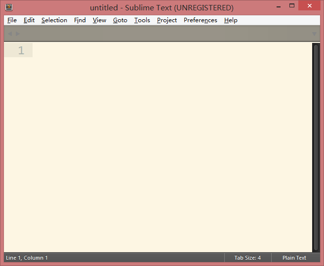  
  图3.1  Sublime Text 3编辑器主界面  
  （2）	在Sublime Text 3中“File”和“Edit”两个菜单功能同其他的编辑器类似，在此需要说明的是，在“文件”菜单下可以选择打开文件夹，同时打开一个文件夹下的多个文件，方便管理同一个文件夹下的多个文件。
  
   
  图3.2  Sublime Text 3打开文件夹选项  
  （3）	在查看菜单下可以设置“语法”，“自动换行”，“进入全屏”等，其中“语法”是选择所使用的语言，比如说：HTML、CSS等；“自动换行”在编写较长的HTML语句时非常有用；以上这些操作较为简单，若要设置以上功能，只需菜单下的查看即可，不做抓图说明。  
  （4）	在“perferences”菜单中选择“Font”和“schema”，可以设置sublimeText编辑器中的字体和配色方案，当我们打开Subime Text 3之后，看到的底色是黑色的，根据个人习惯需要对编辑器的底色进行修改。  
    配色方案的设置方法，如图所示：
  
  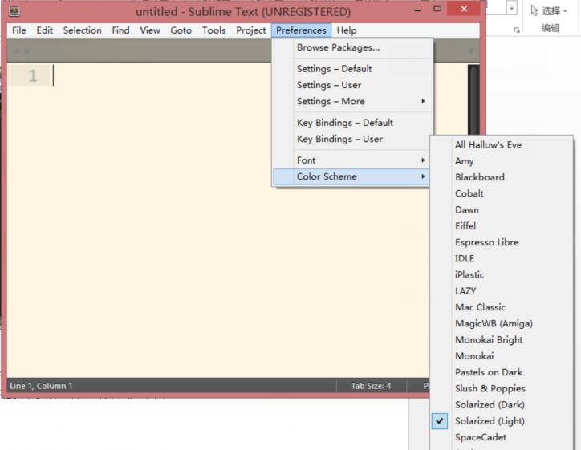 
  图3.3 配色方案  
    如果想修改编辑器的底色，点击配色方案的小三角，编辑器提供了多种选择，效果图如下图： 
    编辑器除了可以修改配色方案，还可以修改字体大小。  
    字体的设置方法，如图所示：
  
  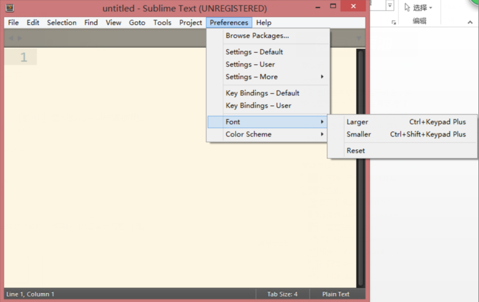
  图3.4 修改字体效果图
### 2	学习该实验中用到的标签
首先，来分析我们最终的页面结效果如下图所示。
  
   
  图3.5 页面效果图  
该页面将要使用到的标签页基本能够确定，经分析总结如下：  
+ 标题标签（`<h1>` 到 `<h6>` 标签）  
定义和用法： `<h1>` - `<h6>` 标签可定义标题。`<h1>` 定义最大的标题。`<h6>` 定义最小的标题。在本实验中，我们将使用`<h1>`为例。
恰当的标签层级来构建文档的结构。因此，请不要利用标题标签来改变同一行中的字体大小。  
+ 段落（ `
` 标签）  
定义和用法：`
` 标签定义段落。p 元素会自动在其前后创建一些空白。浏览器会自动添加这些空间，也可以在样式表中规定。  

## 四、	实验步骤 
### 步骤一  了解编辑器的基本使用  
打开Sublime Text 3编辑器，在界面最上面的工具栏中选择文件---新建（或使用快捷键（Ctr+N） 完成此操作，完成新建页面；然后在选择查看—语法—HTML，选择语言。新建完成后，将文件保存（快捷键Ctrl+S）至合适位置，方便之后插入其他元素。
如图所示，新建文件夹lab1
  
    
  图4.1 新建文件夹lab1
在Sublime Text3中打开lab1文件夹，如下图所示
  
  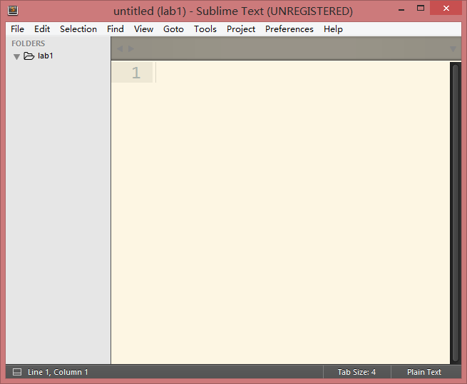 
  图4.2 在sublime中打开文件夹lab1  
在lab1中新建文件first.html，如下图所示：
  
    
  图4.3 在lab1中新建文件
  
  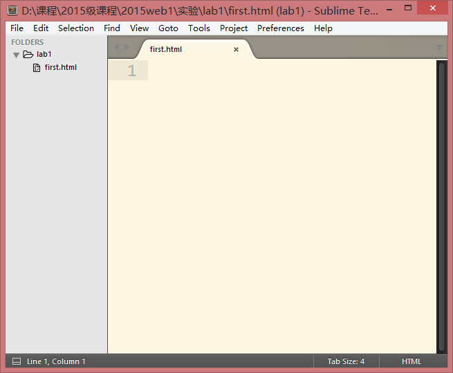  
  图4.4 在lab1中新建文件first.html 
新建完文件后在浏览器中打开，效果如下：
  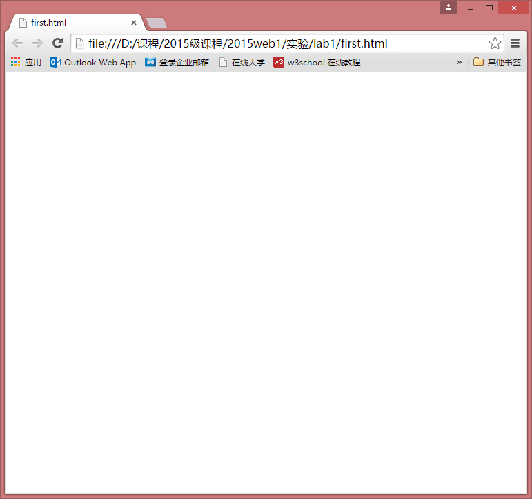 
  图4.5  浏览器打开新建文件 
  
### 步骤二  编写完成页面  
在实验一新建的HTML文件中，填写html的基本结构，如图所示：
  
  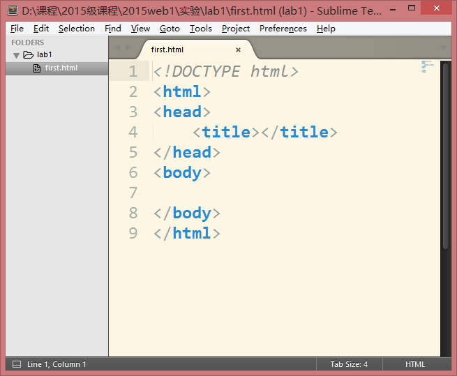  
  图4.6 HTML的基本结构 
这时的网页文件中，已经存在了HTML文件的基本结构，在<head>标签中输入以下一些代码，如下图所示：
  
  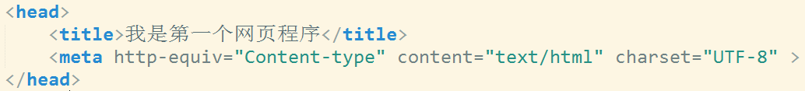  
  图4.7  新建文件中输入的代码  
需注意，`<title>`标签可定义页面文档的标题，浏览器会以特殊的方式来使用标题，并且通常把它放置在浏览器窗口的标题栏或状态栏上。同样，当把文档加入用户的链接列表或者收藏夹或书签列表时，标题将成为该文档链接的默认名称。
通过对于标题标签的学习，我们已经了解了hn标签的使用，此处我们需要将“承德旅游节”作为一号标题文字展示，代码如下，如图所示：
  
  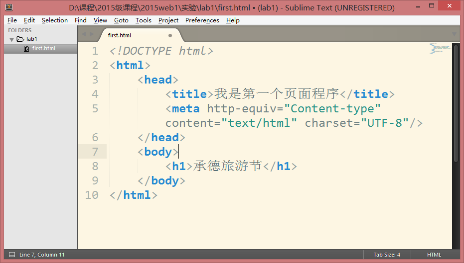 
  `<h1>`标签的基本使用 
通过对于段落标签的学习，我们已经了解了`
`标签的使用，此处我们需要展示段落文字，代码如下，如图所示:  
  
  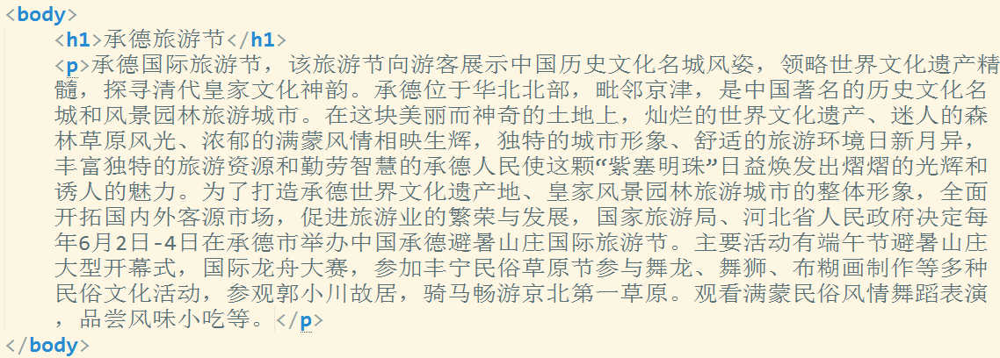   
  图4.9  `
`标签的基本使用  
最终的浏览器显示效果如下图：
  
  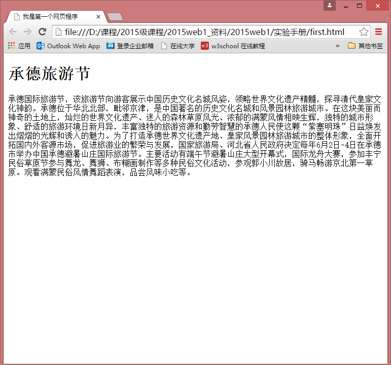 
  图4.10 页面效果
  
### 步骤三  掌握参考手册的用法  
在W3school中，提供了完整的HTML参考手册，其中包括标签、属性、实体等。是学习Web开发的重要工具。使用方法举例说明如下：
首先W3school的URL地址是：http://www.w3school.com.cn/  
在浏览器中打开，如下图所示：
  
  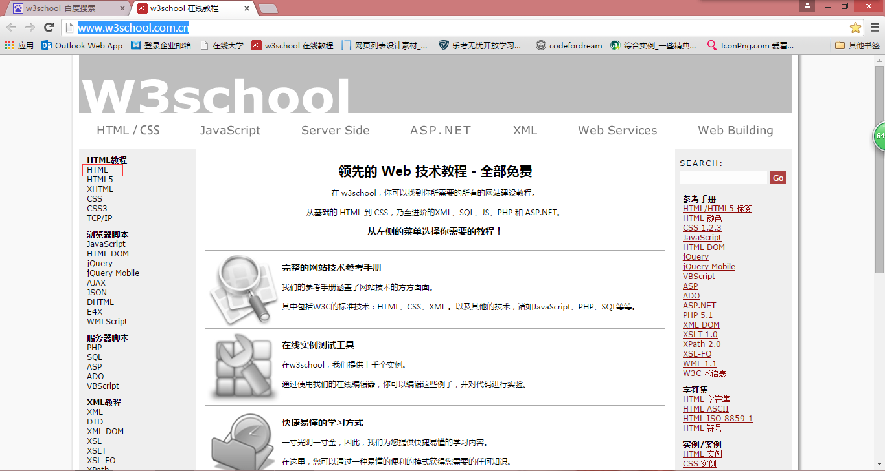
  图4.11  W3school 首页 
在其中选择左侧html帮助链接，进入html学习的首页，如下图所示：
  
  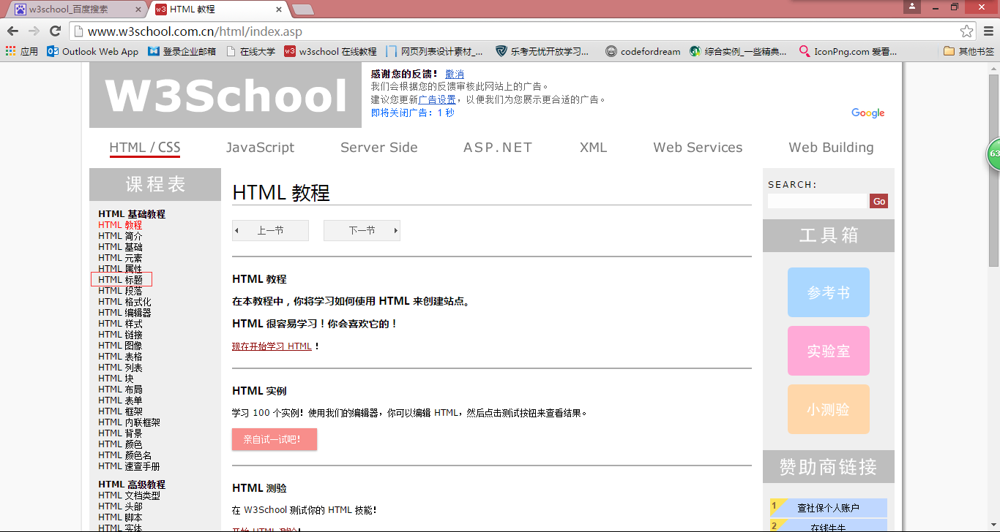 
  图4.12  html首页 
如果我们想学习html的标题标签的使用，在左侧的菜单中选择HTML标题即可，如下图所示：
  
   
  图4.13  html标题的详细介绍 
可以查看相关的词汇知识，语义知识，除此之外，我们还应该查询并掌握与标题相关的属性知识等。 
经历了这个学习过程后，为了能够熟练掌握相关标签和属性的使用，我们还可以在W3School上通过“试一试”来写一些小的实例，加深理解，如下图所示：
  
  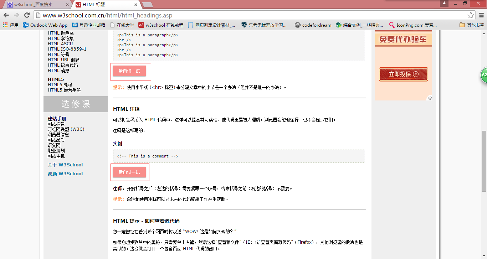
  图4.14  html标题Demo 
  
## 五、	实验作业（完成并提交）

## 六、	推荐阅读 
W3C参考手册   http://www.w3school.com.cn/
