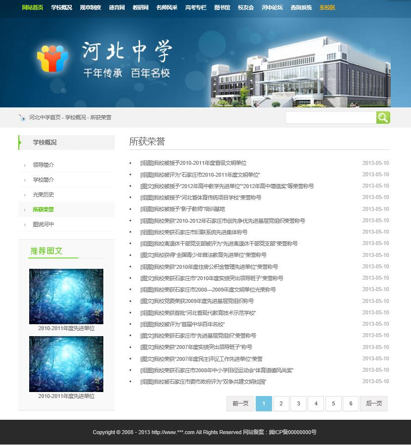
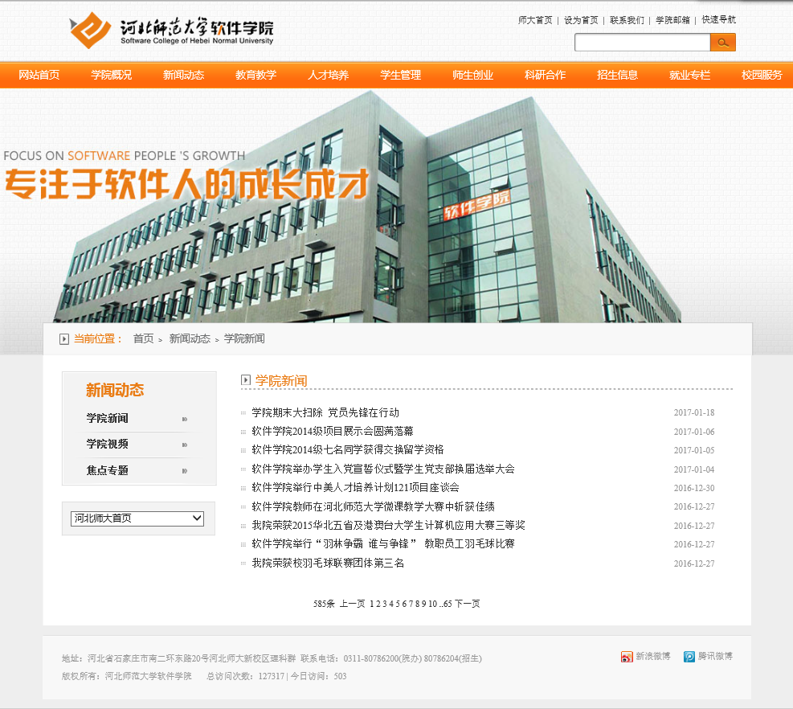
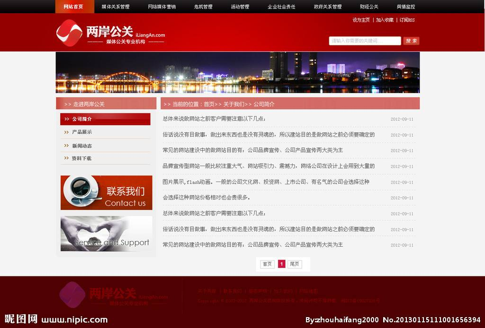

#实验三：网站列表页制作
##一、实验背景
*	本章主要介绍文本、图片、超链接、列表等网页元素，并完成在网页中插入这些元素的过程。掌握各种网页元素的诸多属性，可以灵活的进行相应属性的设置从而显示相应的样式。

##二、实验目标
1.	掌握文本、图片、超链接、列表等网页元素在页面中的实现方法
2.	掌握网站列表页的功能和常见布局，通过元素的插入实现列表页中常见的组成元素
3.	实现如下效果图

	

##三、实验目的
1.	理解文字以及文字样式的设置，并可以完成网页中文字样式设定。
2.	理解相对路径和绝对路径的概念，掌握图片的相关属性设置，并可以在网页中插入图片。
3.	掌握超链接相关属性设置，并可以在网页中插入超链接。

##四、理论基础
1.	文本、图片、超链接和列表在都是页面中最基本的组成元素，分别的使用标记和语法规范请参考http://www.w3school.com.cn/
2.	列表页通常作为一个网站的二级页面，主要功能是显示网站某一栏目中的内容标题列表。请结合实验作业中的问题，分析以下列表页面设计图。

	
	

	

	

	

##五、实验步骤
+ 步骤一：获取素材
>		准备好制作网页所需图片素材，在image文件夹中已提供。
+ 步骤二：创建页面
>		新建网页文件list.html，保存在与image文件夹相同的目录下。
+ 步骤三：构建基本HTML结构
+ 步骤四：从上至下添加网页元素
>>	
+	提示1：该页面中的红框部分为图片元素，所需图片素材在image文件夹中可以找到
+	提示2：页面中所有带下划线的文字均有超链接，链接地址为当前页面
+	提示3：新闻中心栏目中的新闻列表可使用无序列表元素实现，每个列表项均有超链接功能

##六、实验作业
1.	列表页的设计有何规律？
2.	列表页中常出现的功能元素有哪些？
3.	使用Sublime编辑工具完成本实验的网页文件。
