# 实验4 网站首页制作

## 一 实验背景

本章主要介绍文本、图片、超链接、列表等网页元素，并完成在网页中插入这些元素的过程。掌握各种网页元素的诸多属性，可以灵活的进行相应属性的设置从而显示相应的样式。

## 二 实验目标
本次实验实现如下效果的页面：

 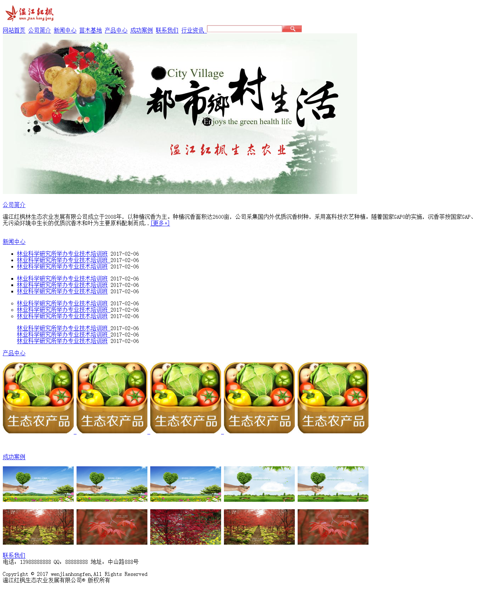
 
## 	三 实验目的
+ 理解文字以及文字样式的设置，并可以完成网页中文字样式设定。
+ 理解相对路径和绝对路径的概念，掌握图片的相关属性设置，并可以在网页中插入图片。
+ 掌握超链接相关属性设置，并可以在网页中插入超链接。

## 	四 理论基础

### 图片
在HTML中，图像由``标签定义。``是单标签。要在页面上显示图片，需要使用源属性`（src）`。src指 "source" 。源属性的值是图像的URL地址。
相对路径：指由这个文件所在的路径引起的跟其它文件（或文件夹）的路径关系。
绝对路径：指从盘符开始直到目标位置的完整路径。
``常用其它属性如图4-1所示

 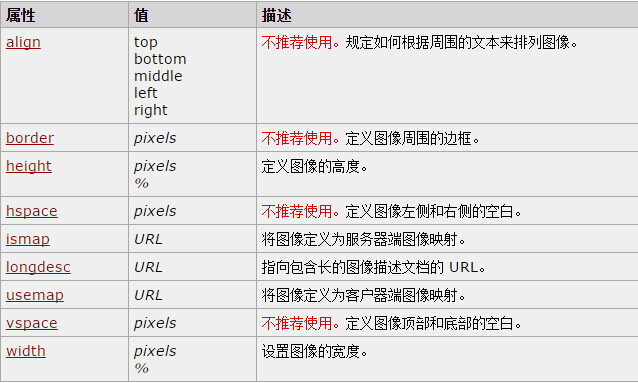
 
图4-1 img标签常用属性

### 超链接
HTML使用超链接与网络上的另一个文档相连，超链接的形式多种多样，可以是文字、图片。``标签内部为超链接内容。超链接常用属性如图3-2所示。
超级链接正如一个网站的血脉，它在各个网站之间建立链接，使网站成为一个有关联的整体。之所以称其为超级链接，是因为超级链接可以应用到网页中的任何元素中，可以使一段文本、一副图像、一个文件或一个邮件地址等，当用鼠标单击这些创建了链接的对象时，浏览器就可以凭借此链接跳转到一个新的对象或页面，甚至可以跳转到页面指定的位置。

  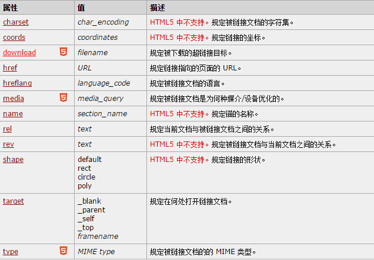
  
图4-2 超链接标签常用属性

## 	五 实验步骤
###   步骤一： 获取素材
制作网页所需图片素材，在images文件夹中已提供。
###   步骤二： 创建页面
新建网页文件index.html，保存在与images文件夹相同的目录下。目录结构如下图：

  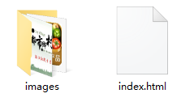
  
图5-1 目录结构

###   步骤三： 构建网页基本结构
写出网页的基本结构，包含文档声明、页面标题和编码声明。如图5-2所示。

  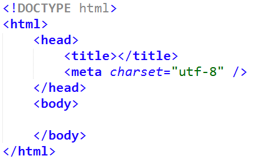
  
图5-2 HTML文档基本结构

添加网页标题，即在`<title>`标签中写入该网页标题。网页效果如图5-4。
 
  
  
图5-3 添加网页标题
 
  
  
图5-4 添加网页标题页面效果

### 	步骤四：构建页面顶部

1.插入网站logo，即在`<body>`中使用``标签插入网站logo图片。

  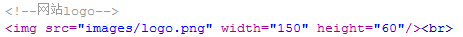
  
图5-5 添加网站logo

实现效果如5-6图所示。

  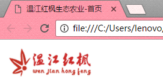
  
图5-6 添加网站logo页面效果

2.构建导航栏，实现过程如图5-7所示。

  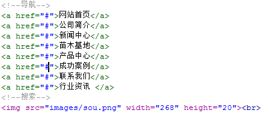
  
图5-7 添加导航栏

得到的网页效果如图5-8所示。
 
  
  
图5-8 添加导航栏后页面效果

3.插入banner，实现过程如图5-9所示。
 
  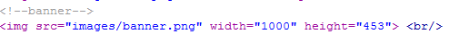
  
图5-9添加导航栏

得到的网页效果如图5-10所示。
 
  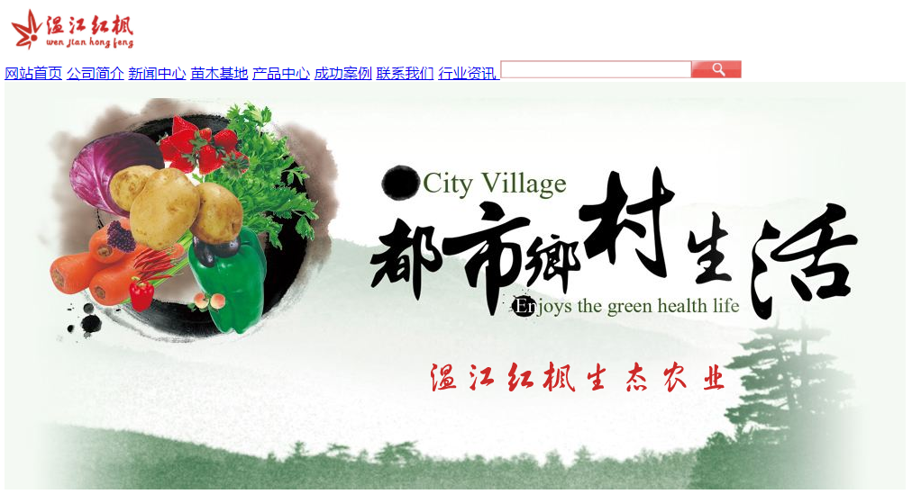
  
图5-10 添加导航栏后页面效果

### 步骤五： 构建页面主体模块

1.插入段落文本

使用` `标签进行换行操作，然后使用<a>标签插入超链接，使用
标签在网页中完成一段文本的插入（
标签会自动在文字段前段后插入一段空白）。得到的网页效果如图5-11所示。

 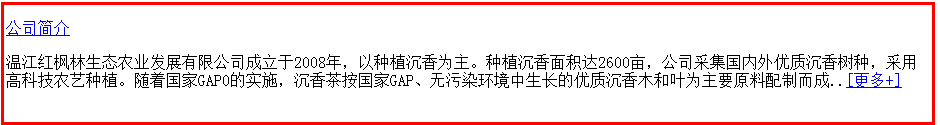
 
 图5-11 插入一段文字效果图
 
2.插入列表

使用` `标签进行换行操作，插入新闻列表。使用列表标签`<ul>`和列表项`<li>`来完成新闻列表的插入。其中每个列表项li又是一个超链接，可通过点击跳转到已经创建好的新闻网页,即要求li里所有链接的链接地址为news.html。`<a>`标签的href属性用来设置超链接（新闻网页）的URL，target属性用来设置在何处打开目标，如： `<li><a href="news.html" target="_blank">`林业科学研究所举办专业技术培训班`</a></li>`。

可通过`<ul>`标签的type属性来完成对列表的列表项符号进行设定，默认为黑色圆点，type="square"为黑色方块，type="circle"为空心圆点，type="none"则没有列表项符号。

部分代码截图如下所示：

  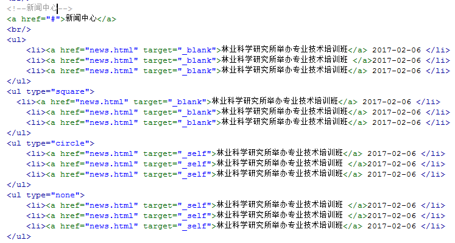
  
最终得到的页面效果如图5-12所示。

  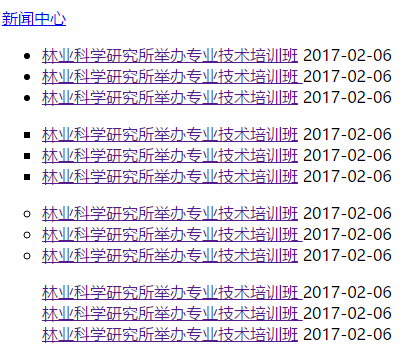
  
图5-12 插入列表

3.插入图片及超链接

使用``标签来完成对图片的插入，可以通过标签的width、height属性来设置图片的宽、高，图片路径需要使用``标签中src属性来设置。设置图片为超链接的内容，需要将图片标签置于a标签内部。当不知道链接到哪里的时候，将a标签的href属性值设置成#。如：
``。得到网页效果如图5-13所示。

  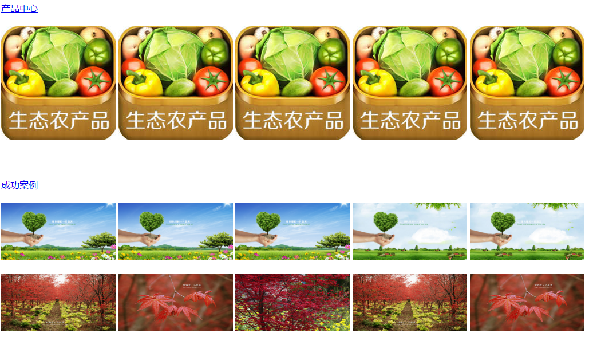

图5-13 插入图片链接

### 步骤六：添加其他信息

1.联系我们，最终效果如图5-14所示：
 
  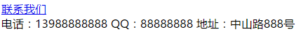
  
图5-14 联系我们

2.友情链接，最终效果如图5-15所示：
 
  
  
图5-15 友情链接

3.添加水平线，最终效果如图5-16所示：
 
  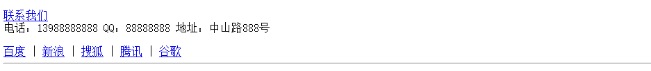
  
图5-16 水平线

4.版权信息，最终效果如图5-17所示：

 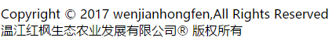
 
图5-17 添加版权信息

###  步骤七：制作内容页

新建网页文件news.html，保存在与images文件夹相同的目录下。使用`<h1>`标签、`<h5>`标签、`
`标签、`<a>`标签和字符实体制作一个新闻网页。制作新闻网页所需要的素材，在实验资料文件夹中已提供。其中，通过点击“返回首页”可以跳转到已经创建好的首页（即index.html）。最终实现的网页效果如图5-15所示。

  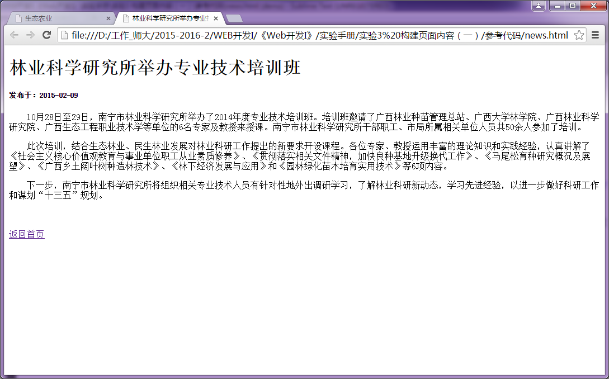
  
图5-15 新建新闻网页

####  步骤八：最终效果

 
 
 图5-12 最终页面效果
 
## 	六 实验作业（由学生完成并提交）

使用Sublime Text 3完成本实验的网页文件。

## 	七 推荐阅读 推荐阅读

http://www.cnblogs.com/sunyunh/archive/2012/08/04/2623133.html
http://www.cnblogs.com/sunyunh/archive/2012/08/04/2623293.html
