# 实验五 用户登录、注册页面
## 一  实验背景
&emsp;&emsp;本章主要介绍HTML列表和表单的概念和制作，包括：表格、表单制作，同时介绍各种表单元素，以及内联框架的使用。通过本次实验可以掌握在何时使用何种元素以及使用各种元素过程中应该注意的问题。
## 二  实验目标
 &emsp;&emsp;本次实验要求完成如下效果页面 
 

  
## 三  实验目的
- 理解表格及其基本概念，学会在网页中插入表格，对表格进行简单修饰。
- 理解表单、表单元素的基本概念，学会如何在网页中插入表单，并完成简单实例。
- 理解内联框架基本概念，学会如何在网页中插入内联框架，可以使用内联框架制作简单页面实例。
    
## 四  理论基础
### 1. 表格
&emsp;&emsp;表格由 table标签来定义。每个表格均有若干行（由 tr标签定义），每行被分割为若干单元格（由td标签定义）。字母 td 指表格数据（table data），即数据单元格的内容。数据单元格可以包含文本、图片、列表、段落、表单、水平线、表格等等。
#### 表格标签及属性
&emsp;&emsp; 表格中常用标签如图4-1所示   

  

图4-1表格常用标签
  

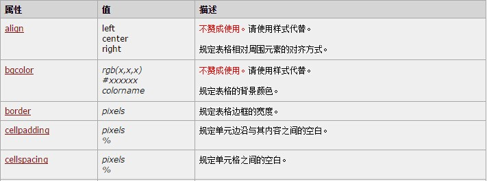
   

图4-2 table标签属性
  
### 2. 表单
&emsp;&emsp;表单（Form）：包含表单元素的区域，用户搜索不同类型用户的输入，并向服务器传输数据。
 表单在网页中主要负责数据采集功能，许多网站中都有客户反馈、用户注册、全文搜索、订单等功能，这些功能通常都要通过表单来实现，应用表单能够实现网站客户端与服务器端的信息交流。表单通常包含众多的表单元素，这些表单元素由文本域、单选按钮、复选框、文本框、下拉列表以及按钮等组成，当用户填写好表单，单击按钮提交时，就给服务器端发送了请求信息，服务器端再对这些用户信息进行处理，将响应信息发送给用户。如下图4-3所示为一个表单的大致处理流程。

 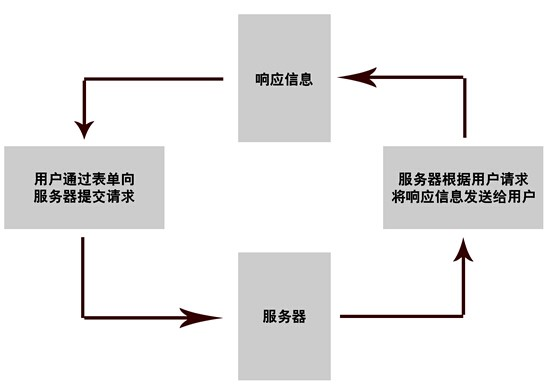
  

 图4-3表单工作过程 
  
### 3. 表单元素
 &emsp;&emsp;允许用户在表单中（比如：文本域、下拉列表、单选框、复选框等等）输入信息的元素。主要包括3类：  
- input。通过指定type的不同属性，设置表单元素的类型。input控件的常见用法有：  
 * 1)&amp;#60;input type=”text” name=”uname” /&amp;#62;，添加单行文本输入框。
 * 2)&amp;#60;input type=”password ” name=”pwd”/&amp;#62;，添加密码输入框。
 * 3)&amp;#60;input type=”radio” name=”gender”/&amp;#62;，添加单选按钮。
 * 4)&amp;#60;input type=”checkbox” name=”hobby” /&amp;#62; ，添加复选框。
 * 5)&amp;#60;input type=”button” name=”button” /&amp;#62;，添加普通按钮。
 * 6)&amp;#60;input type=”submit” name=”sub” /&amp;#62;，添加提交按钮。
 * 7)&amp;#60;input type=”reset” name=”reset” /&amp;#62;，添加重置按钮。
 * 8)&amp;#60;input type=”image” src=”……”  name=”img”  /&amp;#62;，添加图片按钮。
 * 9)&amp;#60;input type=”file” name=”file” /&amp;#62;，添加文件输入域。
 * 10)&amp;#60;input type=”hidden” name=”hid” /&amp;#62;，添加隐藏域。  
 提示：
  * 1)使用表单控件时，其name属性要指定一个值。
  * 2)对于单选按钮控件和复选框控件，必须指定name属性，并且同一组控件的name属性值一定要相同。  
- select  
     创建下拉列表框。与option元素同时使用。
- textarea  
     创建多行文本输入区域。可通过cols和rows属性规定textarea的尺寸。  
     
#### 4. 文本框
&emsp;&emsp;文本框主要用于输入文本，包含单行文本与多行文本，且可以设置文本类型，实现单行与多行文本，如图4-4所示。  
 
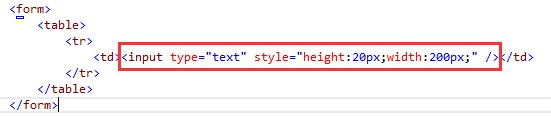
   
 
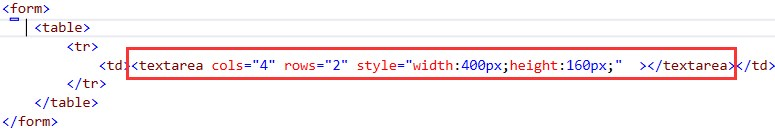
  
 
图4-4（上单行，下多行）
  
&emsp;&emsp;属性设置：在单行文本框中可以设置文本框的高度和宽度，多行文本框中，可以设置文本框的行数和列数，分别使用属性cols(列) rows（列）。得到效果图如图4-5所示。
 
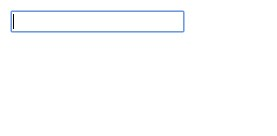
    
 
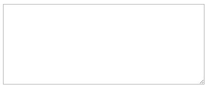
  
 
图4-5（上单行，下多行）
  
 
#### 5. 下拉列表
&emsp;&emsp;在页面中用于选择信息，所占空间较小，但不如复选框或单选框直观。如图4-6所示。
 
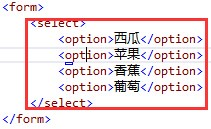
  
 

  

图4-6 下拉列表
  
#### 6. 按钮
&emsp;&emsp;表单中数据提交过程触发一般会使用按钮，按钮根据使用场景的不同可以分为许多类型，比如button、reset、submit，标签为<button></button>可以通过按钮的type属性来进行设置。有关按钮常用属性如图4-7所示。  

    

图4-7 按钮属性
  
#### 7. 单选按钮与复选框
&emsp;&emsp;单选按钮是指在表单对象中在同一状态下只可选择一个选项，当选择其他项时，该项取消选中。单选按钮一般同复选框一样都是成组使用，不同的是在一个组内只可有一个单选按钮被选中。

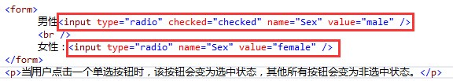
  

  

图4-8 单选按钮
  
&emsp;&emsp;在使用单选按钮时，按钮name属性相同的按钮属于同一组，它们中只有一个可以是属于选中状态。Checked属性设置为checked时，该按钮处于被选中状态，单选按钮常用属性如图4-9。
 
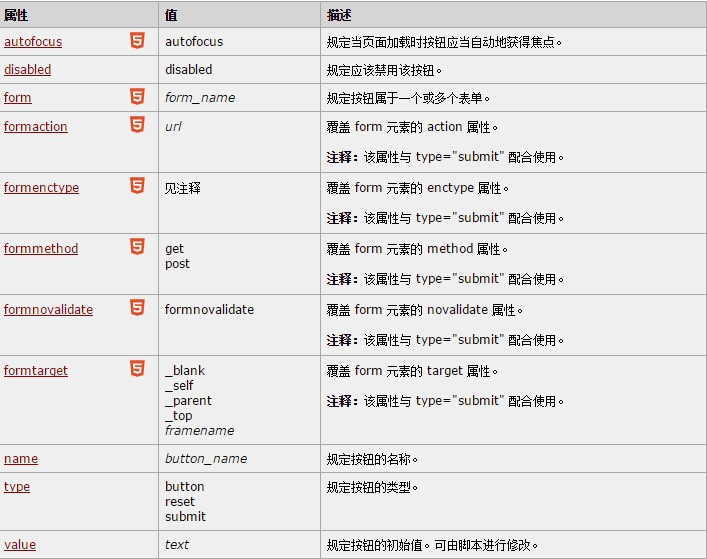
  

图4-9 单选按钮属性
  
&emsp;&emsp;复选框可以让用户在多个复选框组中选择多个选项，每个复选框都有两个状态，“选中”和“不选中”，而且每个复选框之间不受影响。与单选按钮的属性相比，复选框可以同时选择多项内容，并可根据需要在程序中设定可以最多选择的项目个数，复选适用于问卷多选或者投票多选场景中。如图4-10所示  

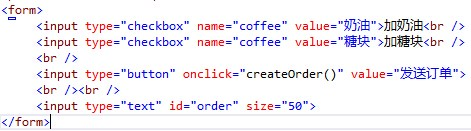
    

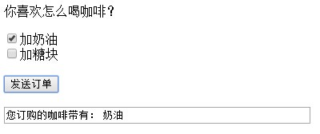
    

图4-10 复选框
  
Checkbox对象代表一个HTML表单中的一个选择框，当设置属性为Checked=”Checked”时，选择框处于选中状态。复选框相应属性如图4-11所示。  

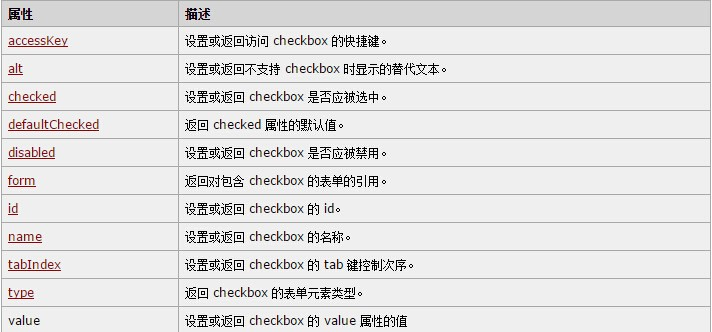
   

图4-11 复选框属性
  

## 五 实验步骤

### 步骤一 表格制作
&emsp;&emsp;通过上述表格内容的学习，我们对表格有了一定的认识，下面我们就使用表格标签来完成一个表格的制作。  
&emsp;&emsp;新建网页文件，并插入一个表格 
&emsp;&emsp;新建html文件，命名为demo.html，建立table表格。  

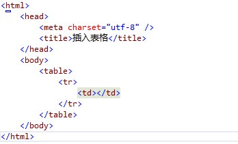
  

图5-1
  
### 步骤二 在步骤一表格基础上制作HTML表单  
&emsp;&emsp;通过上述表单内容的学习，我们对表单有了比较深刻的认识，下面我们就使用表单元素来完成一个表单的制作，即使用表单来完成一个注册页面。  
- 在表格中插入表单元素
&emsp;&emsp;在实验一中我们已经建立好了一个table表格，那么我们就可以将我们的表单元素填充到表格当中，表单元素必须嵌在<form>中，在每一行中插入表单元素如下  

  

图5-2
  
&emsp;&emsp;得到效果图如图5-3所示  

   

图5-3 第一行插入表单元素
  
- 重复在表格中插入表单元素
&emsp;&emsp;重复上一步操作，在各行的单元格中插入相应表单元素，注意表单元素类型选择，如何得到要插入的的表单元素，最终效果图如图5-4所示。   

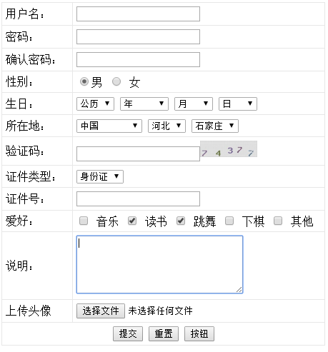
   

图5-4 注册界面
  

## 六  思考并实现
- 到这里，我们已经用表格实现出一个表单。但是，如何实现将表单里面获取到的用户注册信息，提交到某一个地址上去？需要我们做什么操作，又需要我们注意哪些问题？请同学们自行思考，并实现将注册信息提交到地址为[http://10.7.1.98/taozhuo/form_data.php](http://10.7.1.98/taozhuo/form_data.php)的文件中去的功能（获取方式为：get）。  
- 模仿注册页面的实现方式，使用表格和表单完成注册页面的实现，效果图如下：  

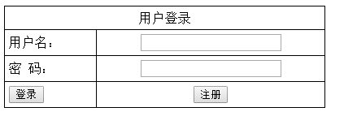
  

## 七  实验总结（由学生完成并提交） 

## 八  推荐阅读
- [http://www.cnblogs.com/sammy1983/archive/2006/06/20/431007.html](http://www.cnblogs.com/sammy1983/archive/2006/06/20/431007.html)
- [http://zc.qq.com/chs/index.html?from=client&pt_clientver=5455&pt_src=1&ptlang=2052&regkey=4AED2736EE8AC2951FCBD7664E5CC4205267385C147B124D30CC567DE61F41C7&ADUIN=0&ADSESSION=0&ADTAG=CLIENT.QQ.5455_NewAccount_Btn.0&ADPUBNO=26550](http://zc.qq.com/chs/index.html?from=client&pt_clientver=5455&pt_src=1&ptlang=2052&regkey=4AED2736EE8AC2951FCBD7664E5CC4205267385C147B124D30CC567DE61F41C7&ADUIN=0&ADSESSION=0&ADTAG=CLIENT.QQ.5455_NewAccount_Btn.0&ADPUBNO=26550)

