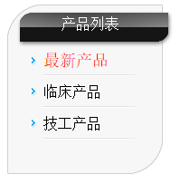
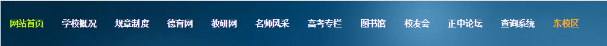
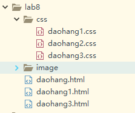
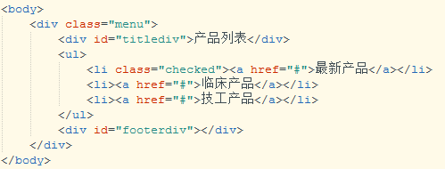
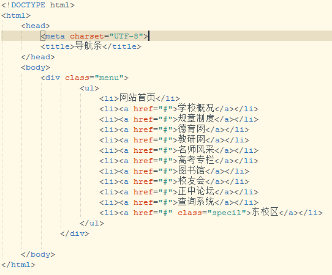
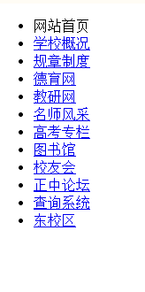

# 实验八 导航条制作
## 一、	实验背景  
&emsp;&emsp;在上一章的实验中，已经开始使用css将页面修饰的更美观了，本章内容的学习，是继续在现有的CSS基础上对网站页面的背景及列表进行修饰，也正是由于CSS对列表的修饰所以才会出现各大网站中漂亮的导航菜单。
## 二、	实验目的
&emsp;&emsp;通过实验能灵活的掌握通过CSS对背景和列表的修饰来完成常见导航条的效果。  
以下是我们在网站的浏览中常见的导航菜单的样式：    

  
图2-1 列表导航  

  
图2-2 列表导航    

  
图2-3 横向导航条   
&emsp;&emsp;本次实验要求实现以上导航菜单的样式。
## 三、	准备材料
本实验目录结构如下：  

  
图 3-1文件目录结构    
&emsp;&emsp;本实验用到的图片素材及文字素材全部在lab8中。
## 四、	实验步骤
&emsp;&emsp;我们实现图2-1和图2-3的导航菜单效果，图2-2导航效果请自行实现。
### 步骤1.	首先实现图2-1效果  
&emsp;&emsp;在daohang1.html中实现html列表元素。图2-1中使用的一个无序列表来展示导航内容，具体的代码如下图所示：  

  
图 4-1 html代码结构
### 步骤2.	样式修饰  
&emsp;&emsp;在daohang1.css文件中编写CSS样式代码，使得达到图2-1的效果。  
&emsp;&emsp;设置“产品列表”div的背景图、宽度和高度。  
&emsp;&emsp;设置无序列表ul的列表项图标、背景图。   
&emsp;&emsp;设置列表项的背景图、位置（宽度、高度）：  
                                margin-left: 40px;  
							 	padding-top: 5px;  
							    background-position: -3em 90%;  
&emsp;&emsp;设置列表项超链接的字体和样式。   
&emsp;&emsp;设置选中列表项超链接的字体和样式。  
&emsp;&emsp;设置效果图中的底端圆角效果，使用圆角的背景图片。 
### 步骤3.	实现图2-3导航效果  
&emsp;&emsp;在daohang3.html文件中编写html元素内容，  

  
图4-2 导航内容html  
&emsp;&emsp;不加任何修饰的效果图如下图：

  
图4-3未修饰的列表效果
### 步骤4.	CSS修饰列表。
&emsp;&emsp;去掉列表项前面的小圆点。    
&emsp;&emsp; 设置列表项中超链接的字体样式。    
&emsp;&emsp; 设置列表横向：在此项样式设置中，涉及到后续会学习的CSS属性float，float属性本意是设置元素脱离父元素，浮动，在本例中想让列表项横向排列需要将列表项标签li的float属性设置为left，即在li元素的CSS 样式中设置float:left。    
&emsp;&emsp;设置无序列表的背景图。  
&emsp;&emsp;设置特殊的列表项（首页、东校区）超链接字体样式。  
实现如图2-3所示。
### 步骤5.	
&emsp;&emsp;参照以上两个导航样式的实现，自行实现图2-2效果的导航菜单，素材均在lab8中。
## 五、	实验总结（此部分内容需跟代码文件一起提交）
 - 总结实验过程中碰到问题及解决办法
 - 实验过程中的感悟   
## 六、 推荐阅读  
 - 网站前端开发(文件,html,js,css)规范文档整理：
 - [http://www.111cn.net/cssdiv/css/57963.htm](http://www.111cn.net/cssdiv/css/57963.htm)

