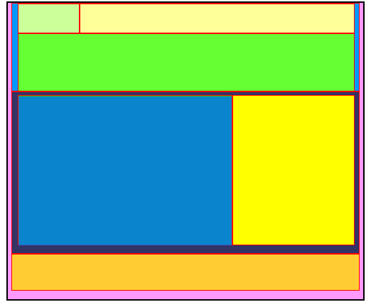
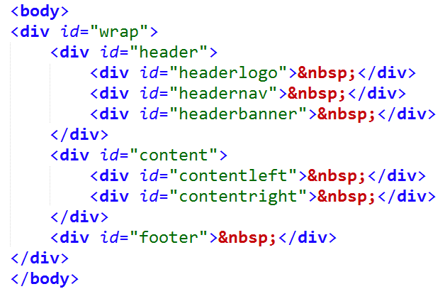

# 实验十 网页布局

## 一、	实验背景
 通过浮动即float属性和clear属性的加入，使页面能够合理布局。
 
## 二、	实验目的
* 熟悉掌握浮动的概念  
* 熟悉掌握float属性的用法和作用  
* 掌握clear属性的用法和作用  
请通过所学浮动知识，实现如下效果图：

 

## 三、	准备材料 
HTML中<body>内代码如下，请同学们先自行完成该部分代码，及HTML基本代码结构：
 

## 四、       实验步骤   
### 步骤一  按照所给代码结构，完成HTML部分代码。   
对这部分代码进行分析，通过其id值可以了解到，网页包括三个部分，分别是“header”、“content”、“footer”，对应了网页的头部、中间内容部分和底部。所有这些内容都放在id为wrap的div里面。  
在header里面，headerlogo是存放logo图片的地方；headernav是存放导航栏的地方；headerbanner是存放banner图片的地方。content里面，contentleft和contentright分别对应页面内容部分的左右两个部分。

### 步骤二  设置网页总体的属性，也就是wrap的属性值  
该部分的属性值为：宽1000px、高835px、边框颜色为#000000粗细5px实线、背景色为#FF99FF、外边距自适应（margin：auto；）。   
  
### 步骤三  设置header部分
样式：宽960px、高245px、边框颜色#FF0000实线3px、背景色#0099FF、外边距自适应、左内边距为15px。
  
### 步骤四  设置headerlogo部分
样式：宽170px、高80px、边框颜色#FF0000实线2px、背景色#CCFF99、外边距自适应。
  
### 步骤五   设置headernav部分
样式：宽77	0px、高80px、边框颜色#FF0000实线2px、背景色#FFFF99、外边距自适应。

### 步骤六    设置headerbanner部分
样式：宽944px、高160px、边框颜色#FF0000实线2px、背景色#66FF33。

### 步骤七    设置content部分
样式：宽960px、高445px、边框颜色#FF0000实线3px、背景色#333366、外边距自适应、左内边距15px、上内边距9px。

### 步骤八   设置contentleft部分
样式：宽600px、高420px、边框颜色#FF0000实线2px、背景色#33CC00。

### 步骤九   设置contentright部分
样式：宽340px、高420px、边框颜色#FF0000实线2px、背景色#FFFF00。

### 步骤十   设置footer部分
样式：宽960px、高100px、边框颜色#FF0000实线3px、背景色#FFCC33、外边距自适应、左内边距15px。

### 步骤十一   调整布局
到这里，每个部分的样式属性已经设置完毕，请同学们根据效果图，添加float属性或clear属性，使其合理布局。
  
## 五、	实验作业（完成并提交）
使用Sublime Text 3完成本实验的网页文件。

## 六、        推荐阅读
CSS浮动  
http://www.w3school.com.cn/css/css_positioning_floating.asp 