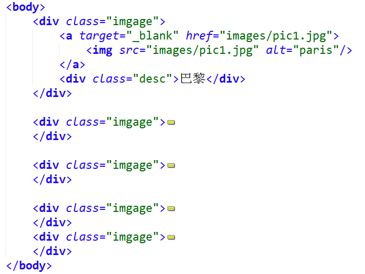
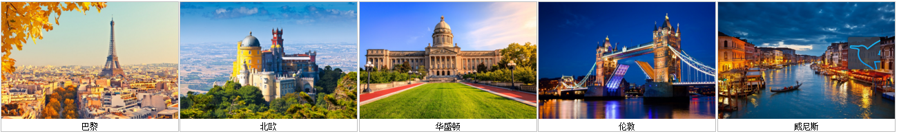

# 实验十一 打造个性化图片库 

## 一、	实验背景 
 本章节实验我们主要讲述两部分内容，首先是由 CSS 创建透明图像；其次是由 CSS 创建图片库。
 
## 二、	实验目的 
使用CSS制作一个简单的图片库。默认情况下图片的透明度为0.5，把鼠标指针移动到图像上后，图标变成不透明的。效果图如下所示。  

        

## 三、	实验步骤 
### 步骤一  建立网站目录结构   

### 步骤二  创建网页布局结构  
  
     

此时页面效果：
     
  
### 步骤三  给图片和描述块设置宽高，并且向左浮动   
此时页面效果：
  
   
  
### 步骤四  对图片文字样式进行微调，设置图片图像透明度 - Hover 效果
默认图片的透明度为0.5，当指针移动到图像上时，图像变为不透明的，对应的 CSS opacity=1，当鼠标指针移出图像后，图像会再次透明。  
  
### 步骤五   给图片链接加上鼠标悬停效果和阴影，这样看起来图片就像悬浮着一样  
  
  
## 四、	实验作业（完成并提交）
使用Sublime Text 3完成本实验的网页文件。