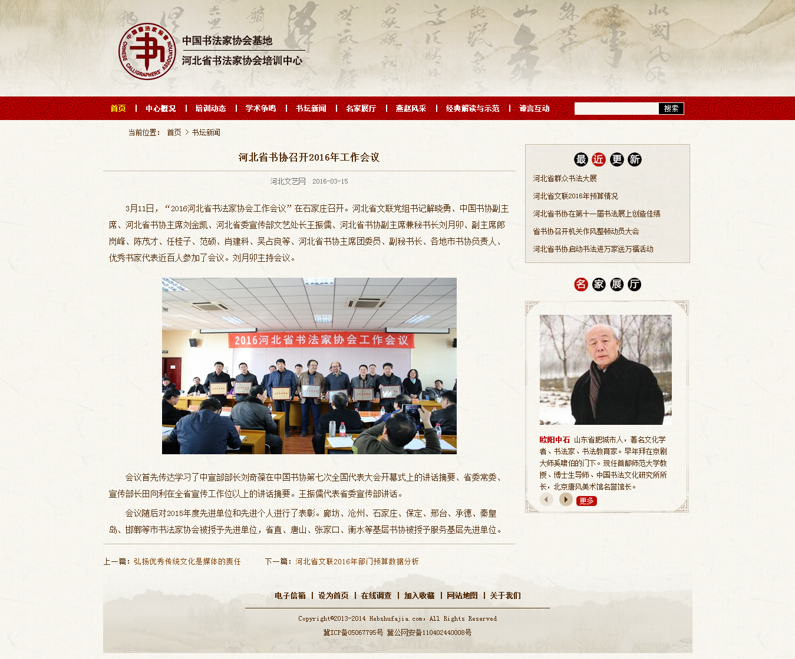
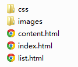
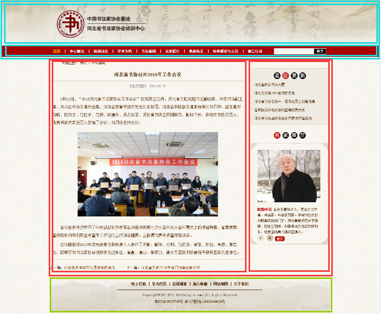
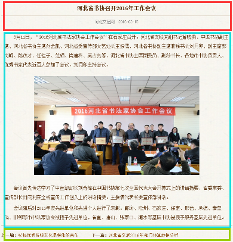
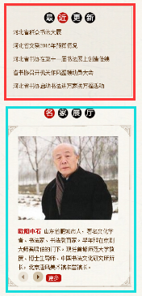

# 实验12 DIV+CSS搭建完整网站
## 一、	实验背景
综合运用目前已经学习的知识，使用div+css实现书法网站静态列表页和内容页。
## 二、	实验目的
在实验8实现了书法网站首页的基础上继续实现列表页和内容页，最终达到以下效果：

 
 
图2- 1列表页效果图

 
 
图2- 2 内容页效果图

## 三、	准备材料
本实验目录结构如下：

 
 
图3-1 文件目录结构

images文件夹存放本实验中用到的图片， css文件统一放到css文件夹中。本实验用到的文本及其它素材在实验材料文件夹中已经给出。

## 四、	实验步骤

### 步骤1.	分析网页的效果图，确定网页结构，即网页分为几块。分块的原则: 从上到下，从左到右，从大到小。以内容页为例，划分的网页结构图如下：
 
 
 
图3-2网页结构图

### 步骤2.	按照从整体到局部，从大到小的原则用HTML实现网页结构。其中网页的顶部Logo、导航栏和底部页脚可以复用首页的代码。

### 步骤3.	用CSS实现网页结构布局。

使用外部样式方式，将html文件和css文件关联起来。先设置通用样式。通用选择器的符号是“*”。不同元素的外边距、内边距、边框等不一致，通过通用选择器可以对所有元素先进行统一设定，以减少后续工作量。为通用选择器添加样式：外边距为上下为0左右为auto（能够达到居中的效果），内边距为0，无边框，字体为宋体，列表无列表符号。

### 步骤4.	设置页面的整体效果。

设置body样式：字号为12px，并根据网页效果图和目前提供的素材，为body添加背景图片（bodybg.gif），在水平重复显示。

### 步骤5.	设置页面内超链接的通用样式。

页面内有大量的超链接，这些超链接有一些共性，进行统一设置，可以大量减少代码量和工作量：设置所有超链接无下划线，鼠标经过超链接时，显示下划线。

### 步骤6.	设置“页面顶部”样式。复用首页代码。

### 步骤7.	设置“页面正文”样式：宽度为1000像素，元素溢出时内容被隐藏，并让该元素位于浏览器页面的中间。 

### 步骤8.	设置“页面正文左侧部分”样式：宽度为700像素，向左浮动。

### 步骤9.	设置“页面正文右侧部分”样式：宽度为280像素，向左浮动，左外边距16像素。 

### 步骤10.	设置“页脚”部分样式。复用首页代码。

至此，完成页面整体布局和修饰，接下来依次填充各部分的页面内容，修饰各部分的样式。（由于页面顶部和页脚可以复用首页代码，以下不再赘述）

### 步骤11.	完成页面正文 “面包屑导航”部分的内容和样式。

1)	完成面包屑导航的内容。其中点击“首页”可以跳转到网站的首页。

2)	设置面包屑导航外层div的样式：高40px，行高40px，左内边距43px。

### 步骤12.	完成页面正文 “左侧”部分的内容和样式。左侧部分又可细分为三块。
 
 
 
图3-3网页正文左侧部分结构图

1)	分别完成三块部分的内容。其中最下方的“上一篇”和“下一篇”后的文章标题为超链接。

2)	设置第一块里面大标题的样式：字号为16px，高45px，行高45px，居中显示，下边框为1px solid #c9baa5。

3)	设置第一块里面副标题的样式：字号为12px，居中显示，不加粗，颜色是#757575，外边距10px。

4)	设置第二块的样式：行高28px，内边距为10px，字号为14px，下边框为1px solid #c9baa5。

5)	设置第二块里面段落的样式：首行缩进2字符，上外边距5px。

6)	设置第二块里面图片的样式：外边距20px。

7)	设置第三块的样式：高40px，行高40px，上外边距10px，字号为13px。

8)	设置第三块里面超链接的样式：右外边距40px，颜色为#844004，字号为13px。

### 步骤13.	完成页面正文 “右侧”部分的内容和样式。右侧部分又可细分为两块。
 
  

图3-4网页正文右侧部分结构图

1)	分别完成两块部分的内容。图片在素材文件夹中提供。

2)	设置第一块的样式：边框1px solid #c9baa5，背景图片bg.png，下外边距20px。

3)	设置第一块里面“最近更新”图片的样式：下外边距10px，居中显示。

4)	设置第一块里面列表项的样式：行高30px，左外边距13px。

5)	设置第二块的样式：宽度280px，上外边距20px，下外边距20px。

6)	设置第二块里面“名家展厅”图片的样式：上外边距25px，下外边距15px，居中显示。

7)	设置第二块里面下方div的样式：背景图片为show_bg.png，高度362px。

8)	设置第二块里面名家图片的样式：左外边距25px，上外边距25px。

9)	设置第二块里面剩余部分div的样式：左外边距25px，上外边距15px，右外边距30px。

10)	设置“欧阳中石”名字的样式：文字加粗，颜色为#b70000。

11)	设置文字的样式：行高20px。

至此，内容页的html内容和css样式已经完成。

### 步骤14.	按照完成内容页的步骤自己实现列表页。

## 五、	实验作业（由学生完成并提交）

使用Sublime Text 3完成本实验的网页文件。

## 六、	推荐阅读

1、	div+css布局模板: http://www.cssmoban.com/cssthemes/

2、	w3school：http://www.w3school.com.cn/css/index.asp
