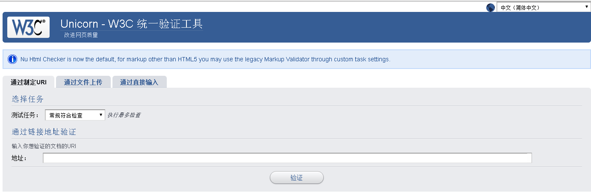
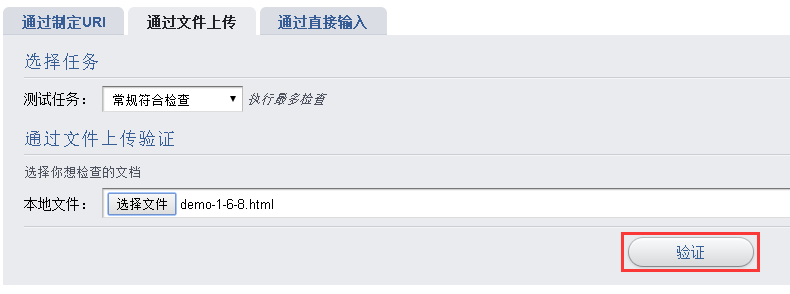
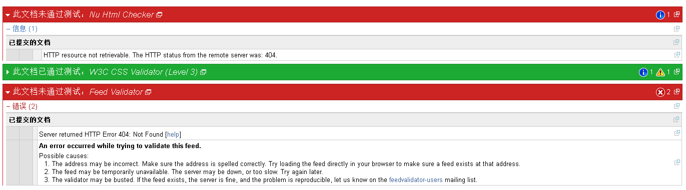

#实验十三 W3C验证工具的使用
##一、实验背景
本章节实验我们来学习通过W3C提供的验证工具来对网页进行验证。如果页面中存在错误，会在验证时候标识出来。通过验证工具的使用，可以准确的找出页面当中元素的错误使用，从而使网页更加规范，而在许多大公司里面，网页通常是需要经过验证才可以发布的。

##二、实验目的
1. 能够熟练使用W3C验证工具，了解验证工具的相关使用。
2. 掌握通过定制URI、文件上传和直接输入这三种方式进行网页验证。

##三、准备材料
###3.1 准备网页文件
为了本实验的进行，需先准备好一个网页文件。这个文件就是用来被验证的内容来源，它可以是网络上的资源，也可以是你本地的一个网页文件，或者你只有部分代码想进行验证也是可以的。

###3.2 打开http://validator.w3.org/unicorn/
这是我们将要验证代码的平台工具，这是一个在线的验证工具，你需要连接网络之后将它打开，准备好。

##四、 实验步骤
###步骤一  将W3C统一验证工具打开
首先，在浏览器中打开w3c验证工具，出现如下界面。

 

###步骤二  选择一种验证方式
现在看到有三种验证方式可以选择:1.通过制定URI；2.通过文件上传；3.通过直接输入。我们选择第2种方式，通过上传文件来进行验证。

 
这时可以看到，页面中有两个地方可以选择，“测试任务”和“选择文件”，可以点击测试任务的下拉列表了解可以进行的任务，本实验以默认的常规符合检查为例，然后点击“选择文件”按钮，选择要验证的本地文件即可，之后点击验证按钮，就可以进行验证了：

 

###步骤三  查看验证结果
验证之后会在当前页面显示验证结果：

 

##五、 实验总结

请同学们按步骤进行练习，并对验证结果进行分析。

##六、 推荐阅读

###6.1 W3C官网的了解https://www.w3.org/
W3C是前端开发的标准，本次实验所使用的验证工具也是W3C官网所提供的，做过实验之后，来了解下这个网站吧，希望能对学习前端的你提供帮助。

###6.2 其他验证工具
除了W3C统一验证工具之外，网上还有一些其他的验证工具，使用过程和意图都是一样的，同学们可以稍作了解。

