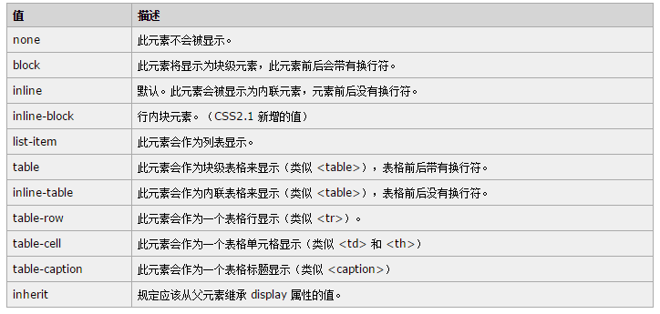
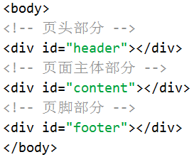
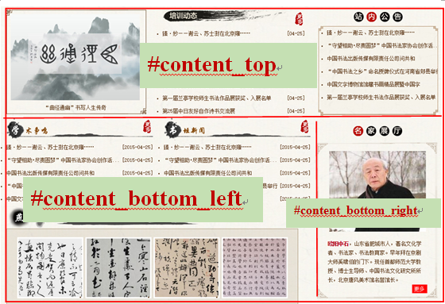

# 实验九 网页基本布局

## 	一 实验背景

在实验5中，我们使用表格`<table>`标签实现网页的结构布局，该方法操作简单，但不利于后期代码维护和调整，同时不利于CSS样式的修饰。在现代Web网页设计中，基本上都是借助DIV+CSS来实现网页结构布局的。

## 	二 实验目标

本实验通过“河北省书法家协会培训中心”首页的设计与实现，来熟练掌握DIV+CSS网页布局的基本思想和使用方法。
 

  
图8-1 “河北省书法家协会培训中心”首页效果图

## 	三 实验目的

+ 熟练掌握在HTML中使用CSS的基本方法。
+ 熟练掌握使用DIV+CSS实现网页布局的方法。
+ 掌握借助浏览器开发者工具调试网页CSS代码的方法。

## 	四 理论基础

### 1.盒子模型

在CSS中任何一个HTML标签均具有一些共有的属性：内容（content）、填充（padding）、边框（border）和边距（margin）等。CSS的这些属性与日常生活中的盒子类似，故称之为CSS盒子模型。
 
   
   
### 2. 元素的显示形式

HTML标签在CSS中具有一些默认的显示外观，例如
标签默认会在当前元素的前后产生换行，而标签则不会换行显示。若一个标签默认在前后产生换行，则这个标签称之为块级元素；否则称之为行内元素。

借助CSS的display属性可以修改元素的显示外面，具体display属性的可选属性值如下所列。

	
### 3. float网页布局

默认情况下，块级元素是不能并排显示的，可以借助CSS的float属性（浮动）实现块级元素的并列显示。

 
 
**浮动一个元素就是指将它从文件流中取出，并按照指定的浮动方向尽可能地向左或向右移动**。“尽可能”是指直到浮动元素的外缘接触到包含区块的边界为止；因此，对于 float:left 来说，盒模型将向左移动，直到其左边界接触到父盒模型的左边界。另一方面，当我们设置一个盒模型向左浮动时，如果已经有了一个向同样方向浮动的盒模型，后面这个盒模型就会在接触到第一个盒模型之后停止浮动，即浮动元素不会互相重叠。

当元素浮动后（不妨为左浮动），其后元素的文档流将从该浮动元素的右侧开始，因此其后元素将不会单独占据一行。为了解决这个问题，可以使用CSS的clear属性对其它元素清除浮动。

 

### 4.DIV+CSS网页布局基本方法

使用DIV+CSS实现网页布局的基本流程是：

1）. 分析网页结构：分析网页的整体结构，对网页进行区块的划分（一般把网页划分成页面头部、页面中部和页面底部）。

2）. 建立网页的HTML结构：使用
和标签以及其它语义性标签建立HTML基本结构。

3）. 使用CSS实现结构布局：结合使用CSS盒子模型、display属性、float属性以及position属性等实现网页结构布局。

4）. 递归1、2、3步，实现网页完整结构。

5）. 添加CSS样式修饰，完善网页效果。

## 	五 实验步骤

###   步骤一： 建立网站目录结构

把实验素材解压缩到指定实验目录，如下图所示。
 
 

图8-2 网站目录结构

1.	css目录为CSS样式表文件保存目录，其中style.css文件为样式表文件；

2.	images目录为图片资源目录；

3. 	index.html文件为网页文件。

###  步骤二： 网页整体布局结构分析

#### 页面结构分析

“河北书法家协会培训中心”首页从整体上可以分为页头、页中和页脚三部分。

 
 
图8-3 页面顶部区域
  
  
图8-4 页面主体区域

  
  
图8-5 页面底部区域

####  HTML结构

  
  
####  CSS样式

此部分设置页面的通用样式和body的样式信息。

1.	页面通用样式：页面整体居中显示；字号（12px）；文字颜色（#522a06）；所有元素内边距为0；文字字体为宋体；所有图片元素无边框；所有列表无项目符号；所有超链接无下划线；所有超链接未点击时文字颜色为#522a06；所有超链接鼠标经过时添加下划线。

2.	body标签样式：背景图片为images/bodybg.gif。

###  步骤三：设置网页顶部代码

####  页面结构分析

页面顶部又可以细分为Banner图片区域和导航栏区域。

  
  
图8-6 页面顶部结构
 
####  HTML结构

  
  
####  CSS样式
1.	#header样式：高度205px；背景图片images/bg.gif；背景平铺方式（水平居中、垂直居上）。

2.	#banner相关样式：宽度1000px；高度164px；水平居中；logo图片居中上边界38px，居左边界25px；logo图片使用``标签插入到页面，图片为images/logo.png。

3.	#nav相关样式：高度40px；背景图片images/nav.jpg；内容部分（.nav_body）宽度为1000px，水平居中；导航栏宽度800px，文字加粗，文字颜色#fff；导航栏中的超链接行高为40px，鼠标经过时文字颜色为#f9f603，鼠标经过时无下划线；“首页”链接文字颜色为#f9f603。

4.	搜索框相关样式：输入框为`<input type=”text” />`，宽度为140px，高度为19px，背景颜色为#f8f5ee；“搜索”为`<input type=”button” />`，宽度为44px，高度为21px，背景颜色为#000，文字颜色为#fff，边框为1px  solid  #f8f5ee。

###   步骤四：分析页面主体结构

####  页面结构分析
 
   
   
图8-7 页面主体部分结构

####  HTML结构

   
   
####  CSS样式

1.	#content样式：宽度1000px，水平居中显示，清除左右两侧的浮动。

2.	#content_top相关样式：设置overflow属性为hidden；*思考为什么？*

3.	#content_bottom_left相关样式：宽度715px，左浮动。

4.	#content_bottom_right相关样式：宽度280px，上外边距20px，右浮动。

###   步骤五：设置#content_top部分

####  页面结构分析
 
  
  
图8-8 #content_top部分结构

####  HTML结构

   
   
####  CSS样式

1)	#news_pic相关样式：宽度324px，高度243px；背景图片images/news_bg.png；左浮动；图片区域宽度300px，高度200px；图片文字区域宽度300px，高度22px，居中对齐。

2)	#news_list相关样式：宽度330px，左外边距38px，左浮动；标题部分“培训动态”背景图片为images/change.png；“更多”链接为一``标签，右浮动；新闻列表为ul > li > a结构，其中li的行高为30px；新闻标题后的时间为一``标签，右浮动。

3)	#news_announce相关样式：宽度277px，上外边距为20px，右浮动；标题“站内公告为一”背景图片images/board.png；公告列表部分宽度285px，高度210px，背景图片images/board_bg.png。

###   步骤六：设置#content_bottom_left代码

####  页面结构分析
 
   
   
图8-9 #content_bottom_left结构
####  HTML结构
 
   
   
####  CSS样式

1)	“学术争鸣”部分样式：宽度340px；标题部分“学术争鸣”高度54px，背景图片images/academic.png；其它样式信息同#news_list区域。

2)	“书坛新闻”部分样式：宽度340px，左外边距25px；标题部分“书坛新闻”高度54px，背景图片images/book_news.png；其它样式信息同#news_list区域。

3)	“燕赵风采”部分样式：宽度700px，清除两侧浮动；标题“燕赵风采”背景图片为images/fengcai_bg1.png；四张图片为“div>ul>li>a>img”结构，其高度为136px，内边距为20px，背景图片为images/fengcai_bg2.png；其它样式请自动设置。

###    步骤七：设置#content_bottom_right代码

####  页面结构分析
 
   
   
图8-10 页面顶部结构

####  HTML结构

该部分HTML代码比较简单，不再赘述。

####  CSS样式

1)	标题部分：高度23px；背景图片images/show.png。

2)	内容部分：宽度362px，背景图片为images/show_bg.png；

3)	图片宽度为224px，水平居中对齐。

4)	其他部分请根据效果图自行补充。

###    步骤八：设置页脚代码

####  页面结构分析
 
   
   
图8-11 页脚结构

####  HTML结构

该部分HTML代码比较简单，不再赘述。

####  CSS样式

1)	页脚区域高度为105px，清除浮动，背景图片为images/foot.gif。

2)	友情链接部分为“div>ul>li>a”结构。

3)	分割线为图片images/line.jpg。

## 	六 实验作业（完成并提交）

使用Sublime Text 3完成本实验的网页文件，把作业上传到`https://github.com`上，并把`https://github.com`地址提交到雪梨教育同步课程相应任务下。

## 	七 推荐阅读

http://www.divcss5.com/
http://blog.csdn.net/mercop/article/details/7882000

